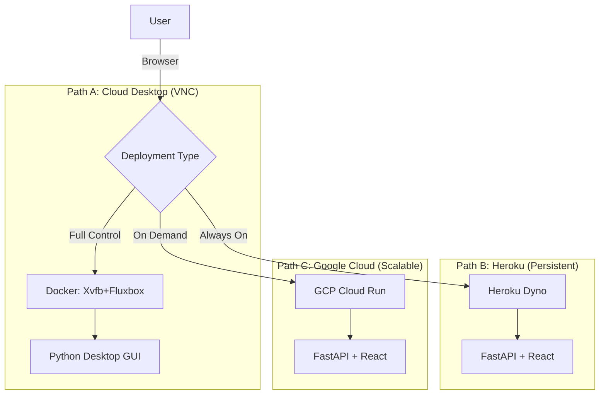

# CoomerDL Deployment Strategy & Map

This document outlines the strategic deployment map for CoomerDL, bridging the gap between the current VNC-based "Cloud Desktop" and the modern "Native Web App" architecture.

## 1. Status Report

| Component | Status | Description |
|-----------|--------|-------------|
| **Desktop App (VNC)** | ✅ Mature | Full GUI experience via browser (noVNC). Supports all advanced features including `yt-dlp` fine-tuning. |
| **Backend API** | 🟡 Functional | FastAPI-based. Supports core downloads but currently lacks the granular `yt-dlp` options of the desktop app. |
| **Web Frontend** | 🟡 Beta | React-based UI. Functional for basic tasks but simpler than the Desktop GUI. |
| **Deployability** | 🟢 Ready | Scripts exist for GCP. Heroku support is being added. |

---

## 2. Deployment Map

We offer three primary deployment paths to suit different use cases.

### 🗺️ The Map



### Path A: Cloud Desktop (VNC)
*   **Best For:** Power users who need full control over every setting (cookies, ffmpeg args, specific formats).
*   **Tech Stack:** `Dockerfile` → Xvfb + Fluxbox + x11vnc + novnc.
*   **Pros:** 100% Feature parity with local desktop app.
*   **Cons:** Heavier resource usage, harder to use on mobile.

### Path B: Native Web App (Heroku)
*   **Best For:** **Continuous Operation**. Running as a 24/7 backend downloader or simple web interface.
*   **Tech Stack:** `Dockerfile.webapp` (or Procfile) → FastAPI + React.
*   **Pros:** Easy to manage, persistent storage (ephemeral filesystem requires cloud storage integration for long-term), "Set and Forget".
*   **Cons:** Currently has fewer advanced settings than the Desktop app.

### Path C: Native Web App (GCP)
*   **Best For:** **Scalability & Cost**. Spins up on demand, scales down to zero when unused.
*   **Tech Stack:** `cloudbuild.yaml` → Cloud Run.
*   **Pros:** Pay-per-use, highly scalable.
*   **Cons:** Cold starts, stateless (requires external storage like GCS).

---

## 3. Backend-Only Mode

You can deploy CoomerDL strictly as a **Backend Tool** (Headless).

*   **UseCase:** Automating downloads via scripts, cron jobs, or integrating with other home lab tools (e.g., Sonarr/Radarr style).
*   **Deployment:** Use Path B (Heroku) or Path C (GCP) but interact purely via the API.
*   **API Docs:** Available at `/api/docs` (Swagger UI) on your deployed instance.
*   **Automation Example:**
    ```bash
    curl -X POST https://your-app.herokuapp.com/api/downloads/start \
      -H "Content-Type: application/json" \
      -d '{"urls": ["https://twitter.com/user/status/123"], "options": {"download_videos": true}}'
    ```

## 4. Recommendation for Heroku

For your goal of **"Deployment directly to Heroku to keep it running without break"**:

1.  **Use Docker Deployment:** We have updated `Dockerfile.webapp` to be Heroku-compatible. This ensures the environment is identical to GCP.
2.  **Persistent Storage:** Heroku filesystems are ephemeral (wiped on restart).
    *   *Action:* Configure **Google Cloud Storage (GCS)** or **AWS S3** in your environment variables (`STORAGE_TYPE=gcs`) so your downloads survive restarts.
3.  **Database:** Use Heroku Postgres (attached by default on many plans) or keep SQLite (but SQLite DB will reset on restart).
    *   *Action:* Set `DATABASE_URL` to a persistent Postgres instance for reliable history.
